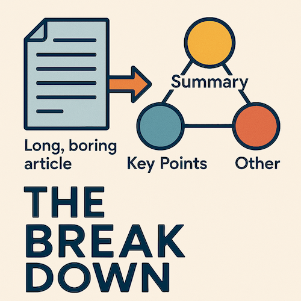
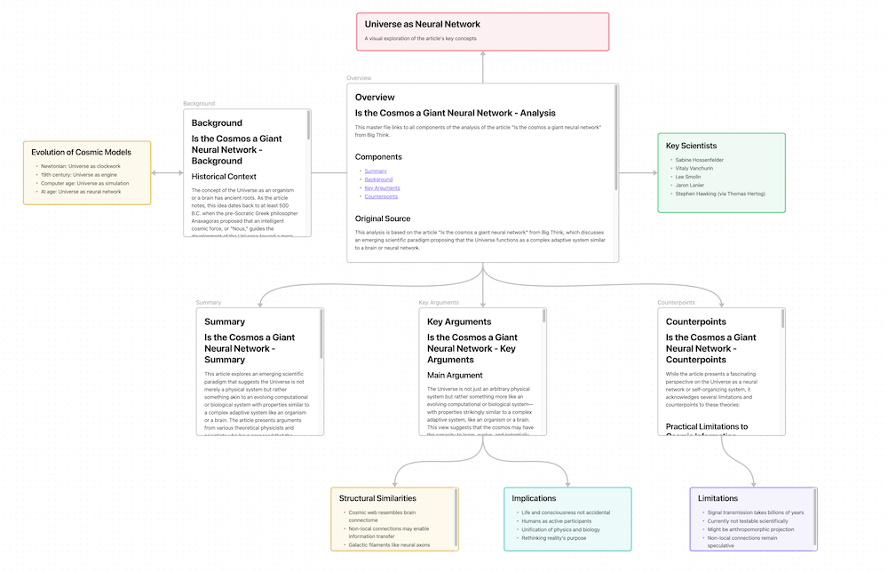

# Break Down

Do you come across interesting articles and think "I dont have time to read this now but let me save it for later", just to never ever read them? You are not alone! A big blob of text is not the most appetizing or digestible way to consume information and with the magic of LLMs,  we can make that experience much better with the Break Down.

Just use the [Obisidian Web Clipper](https://obsidian.md/clipper) to save any article/paper you come across and a new canvas will automagically appear in your vault that shows you a beautiful graph with summary, key points, author information, background etc.

[Long article](https://bigthink.com/hard-science/the-universe-may-be-a-giant-neural-network-heres-why/) goes in and an accessible chart comes out:

## Installation

## Usage

## Roadmap

## Project planning

Link to the document - [link](https://docs.google.com/document/d/1oWGUL3sdZ1EguwfSIu6f4EkGNvAQtOB-9UYtAwlqiRI/edit?usp=sharing)
