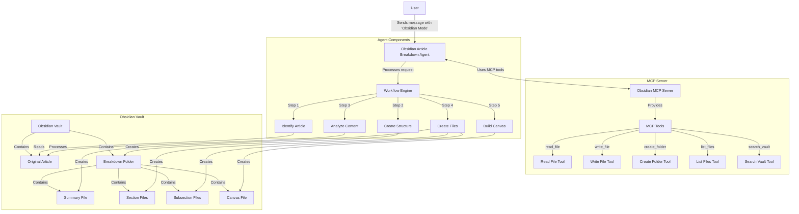
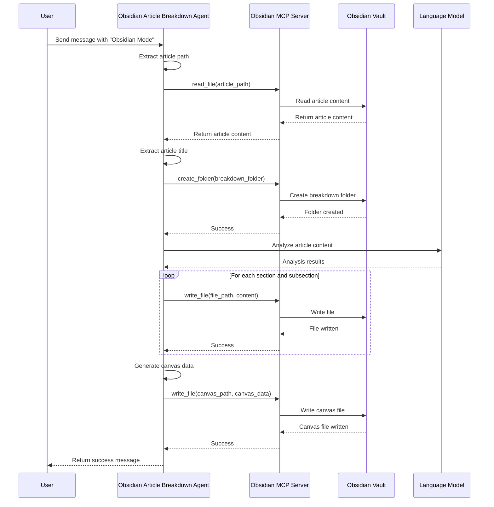
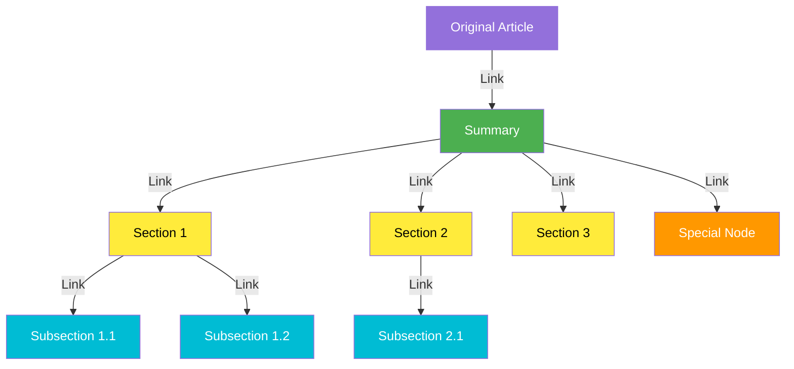

# Obsidian Article Breakdown Agent Architecture

This document describes the architecture and workflow of the Obsidian Article Breakdown Agent.

## Architecture Diagram



## Workflow Description

The Obsidian Article Breakdown Agent follows a systematic workflow to create structured breakdowns of articles:

1. **Identify Article**: The agent identifies the article in the Obsidian vault based on the path provided by the user.

2. **Create Structure**: The agent creates a new folder in the Obsidian vault to contain the breakdown files.

3. **Analyze Content**: The agent analyzes the article content to identify sections, subsections, and special content.

4. **Create Files**: The agent creates markdown files for the summary, sections, subsections, and special content.

5. **Build Canvas**: The agent creates a canvas file with a visual representation of the article structure.

## Component Interactions



## File Structure

The agent creates the following file structure in the Obsidian vault:

```
[ArticleTitle]-Breakdown/
├── 00-Summary.md
├── 01-[MainSection].md
├── 01.01-[Subsection].md
├── 01.02-[Subsection].md
├── 02-[MainSection].md
├── ...
├── Key-Concepts.md (optional)
├── References.md (optional)
└── [ArticleTitle]-Breakdown.canvas
```

## Canvas Visualization

The canvas file creates a visual representation of the article structure with the following layout:



The canvas uses color coding to distinguish different types of nodes:
- Original article: Purple
- Summary: Green
- Level 1 nodes (main sections): Yellow
- Level 2 nodes (subsections): Cyan
- Level 3 nodes (sub-subsections): Blue
- Special nodes: Orange
